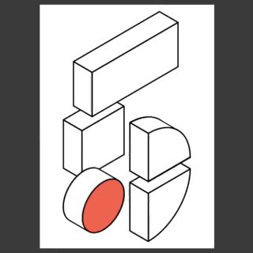
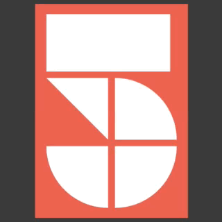
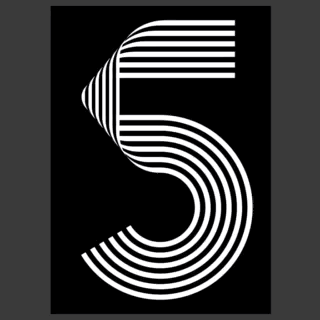

# Posters for Work&Co's 5th year anniversary

This repository contains code to generate Work&Co's 5th anniversary posters.

The code uses no external assets or resources; all graphics are purely code-drawn. Similarly, all animation is code driven.

Each folder contains code for one of the posters, as follows:

| Threedee | Geometric | Lines |
|----------|-----------|-------|
|  |  |  |

## Playing around

This project is setup in a way so that it uses no external dependencies and has no build workflow. It doesn't need Webpack, Babel, Grunt, Gulp, or any of the tools normally used to build "real" websites.

This means that files can be edited in any text editor, and reloaded in the browser without the need for specialized tools, without the need for complicated setup or the use of the command line.

If you want to play around with the code for each poster:

1. Download [a ZIP file with the source code](archive/master.zip).
1. Expand that ZIP file anywhere on your computer.
1. Open one of the folders (`threedee`, `geometric`, or `lines`).
1. Drag the `index.html` from that folder into your browser.
1. Open the `index.js` file from that folder on your text editor of choice.
1. Go back to the browser, and reload the poster window.

## Contributing

Anyone can contribute code fixes and changes. For example, the code doesn't work that well in Safari or Firefox. It could also be made more performant or flexible in several parts. Can you improve on it?

To contribute, clone the code using a Git client (you may want to use [GitHub's own desktop client](https://desktop.github.com/)) and sending a Pull Request.

## License

[MIT](LICENSE.md).
